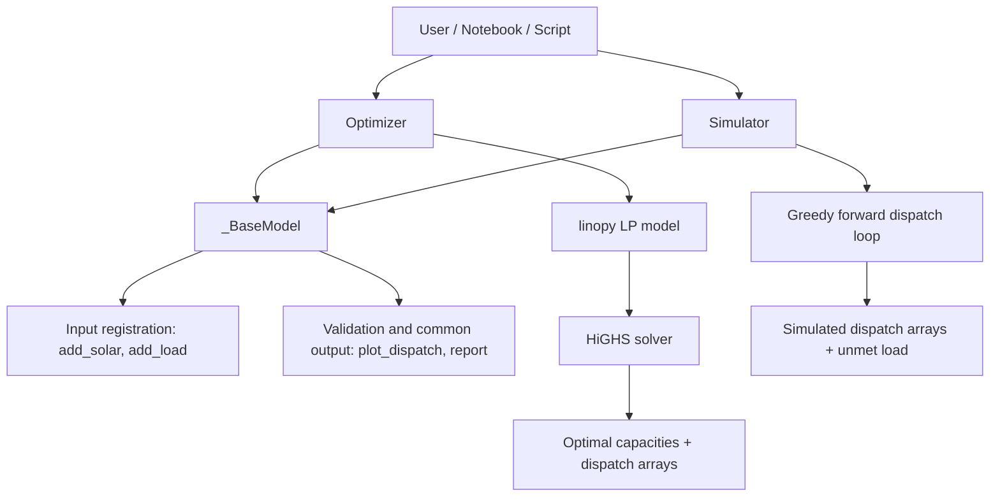
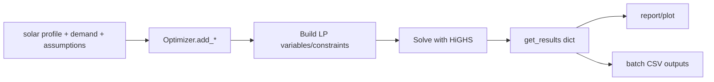

# Executive Summary

This project provides a practical first suite of Python tools for battery energy storage system sizing in solar-plus-load contexts. The model scope is intentionally narrow: it tackles energy balance and dispatch feasibility before introducing richer layers such as full market participation, degradation economics, and network constraints. That narrowing is deliberate. For an early-stage design workflow, it is often more useful to have a transparent and reproducible baseline than a highly complex model with opaque behavior.

The repository now supports a clear two-mode workflow. In optimization mode, battery power and energy capacities are solved endogenously. In simulation mode, candidate battery designs are treated as fixed inputs and stress-tested chronologically. This split has enabled a more disciplined decision process: generate candidate sizes, screen them, then validate performance under representative operating patterns.

Recent repository updates and regenerated outputs confirm that this workflow is stable and repeatable. The model remains computationally lightweight while producing interpretable sizing distributions, candidate trade-off comparisons, and a coherent bridge toward forecast-driven validation using Elexon data preparation logic.

# Project Goals

## Problem Being Solved

Given demand and solar availability profiles, the project aims to determine battery sizing and dispatch behavior that reduces unmet load while balancing capital cost. In practical terms, this means identifying a battery that is neither unrealistically small nor economically excessive for the profile family being studied.

## Intended Users

The intended users are energy modelers who need rapid sensitivity analysis, engineers who want a transparent optimization baseline before adopting richer formulations, and analysts who need to prepare shortlists ahead of bankability-grade studies.

## Scope

Implemented scope includes:

- Linear-program optimization with battery power and energy as decision variables.
- Greedy forward simulation for fixed-size batteries.
- Reusable plotting and text reporting utilities.
- Notebook workflows for batch daily runs, candidate design screening, and forecast preprocessing.

Current out-of-scope features include:

- Detailed tariff/revenue stacking and market participation.
- Degradation, lifecycle economics, and replacement scheduling.
- Network constraints (import/export limits, curtailment policy, reserve constraints).

## Expected Outcomes

- A defensible first-pass battery size range.
- Candidate ranking on reliability and simple economic proxies.

# Repository Structure

| Path | Purpose |
|---|---|
| `src/` | Core package implementation (`Optimizer`, `Simulator`, shared `_BaseModel`). |
| `scripts/` | Example entry scripts for optimization and simulation runs. |
| `notebooks/` | End-to-end exploratory and decision-support workflows. |
| `data/solar_profiles.csv` | Daily solar profile matrix (24 rows x many day columns). |
| `results/` | Generated outputs grouped by workflow stage. |
| `requirements.txt` | Runtime dependency pinning. |

Notes:

- `src/bess_model(old).py` preserves a legacy/transition API.
- `scripts/messy_model.py` contains the original prototype-style implementation used as a refactor baseline.

# High-Level Architecture

The architecture separates shared model IO concerns from solver-specific behavior.



Design intent:

- `Optimizer` answers: "What size should the battery be?"
- `Simulator` answers: "How does a chosen size perform?"

# Data Flow

## Optimization Path



## Simulation Path


## Forecast Ingestion Path (Notebook Prototype)


# Main Components

## `src/_base.py`

Shared abstract base class used by both optimizer and simulator.

Responsibilities:

- register/validate solar and load inputs,
- enforce equal horizon lengths,
- standardize output interfaces,
- provide common plotting and text-report generation.

Impact:

- removes duplicated presentation logic,
- guarantees consistent `get_results()` key contracts across subclasses.

## `src/bess_optimizer.py`

LP-based battery sizing model using `linopy` and HiGHS.

Responsibilities:

- define scalar sizing variables:
  - battery power capacity (MW),
  - battery energy capacity (MWh),
- define per-timestep dispatch and unmet variables,
- enforce energy-balance and SOC dynamics,
- optimize capex + unmet penalty objective,
- expose solved results as arrays/scalars.

## `src/bess_simulator.py`

Fixed-size chronological dispatch simulator.

Responsibilities:

- consume known battery power/energy capacity,
- run greedy charge/discharge policy at each step,
- track SOC and unmet load,
- return same result schema as optimizer where possible (`objective_value = None`).

## `src/bess_model(old).py`

Legacy combined model with broader argument flexibility. Useful as historical context but superseded by the cleaner split between optimization and simulation modes.

## Notebook Workflows

- `01_minimal_bess_usage.ipynb`: minimum viable usage and API demonstration.
- `02_batch_daily_profiles.ipynb`: 365 daily optimizations and percentile-based sizing suggestions.
- `03_candidate_design_screening.ipynb`: candidate shortlist scoring and full-year validation comparison.
- `04_elexon_api_test.ipynb`: data pipeline from Elexon day-ahead forecasts into normalized profile arrays.

Taken together, these notebooks form a coherent engineering narrative: from model sanity checks, to distributional sizing, to candidate comparison, to real-data integration.

# Algorithms

## 1) Endogenous Sizing via Linear Programming

Intuition:

- If unmet load is very expensive, the model buys enough battery power/energy to avoid it whenever feasible.
- If the capex costs outweigh penalty savings for certain periods, unmet load may remain.

Key ingredients:

- linear constraints for dispatch feasibility,
- cyclic SOC linking horizon end to start,
- linear objective mixing capex and reliability penalty.

## 2) Greedy Forward Simulation for Fixed Sizes

Intuition:

- In each hour, use solar first.
- Charge with surplus, discharge during deficits, both constrained by power and SOC limits.
- Any residual deficit becomes unmet load.

Why greedy is acceptable here:

- Intended for quick chronological validation, not global optimal control.
- Computationally cheap for many candidate runs.

Tradeoff:

- May underperform relative to an optimization-based receding-horizon control policy.

## 3) Candidate Screening Heuristic (Notebook)

The screening approach uses optimization-derived daily sizing distributions to build practical candidate designs (for example P50, P80, P90, and maximum designs), then compares those candidates through a simulation KPI table. This creates a useful middle layer between pure optimization outputs and final investment decisions.

# Updated Findings (Current Results)

The latest outputs in `results/02_optimization_results/batch_daily_sizing_results.csv` and `results/03_candidate_design_screening/candidate_designs_summary.csv` lead to several important observations.

From 365 daily optimization runs:

- 252 days produce non-zero battery sizing.
- 113 days produce zero optimal sizing under current assumptions.
- Mean optimal power is 52.799 MW.
- Mean optimal energy is 262.562 MWh.
- P80 design point is 102.7 MW and 656.784 MWh.
- P90 design point is 117.0 MW and 700.993 MWh.
- Maximum observed design point is 156.3 MW and 806.486 MWh.
- Mean solve time is 4.466 seconds per daily run.

These results reinforce a core point: under a high unmet-load penalty but with fixed capex assumptions, the model still does not select storage on every day. In other words, there are profile regimes where additional battery does not pass the model's marginal-value threshold, even before richer economics are introduced.

The updated candidate summary for the tested 24-hour validation horizon shows a strong diminishing-returns pattern:

- P80, P90, Max, and Yearly max all serve 1386.0 MWh out of 1648.0 MWh (84.10% reliability in this specific run).
- Their unmet load remains 262.0 MWh despite increasing capex.
- P50 and No battery are materially worse in served energy and unmet-load metrics.

This is exactly the kind of result that a screening workflow should surface: beyond a certain design threshold, added battery capacity may increase cost without improving reliability for the active bottleneck period. That does not mean larger batteries are never justified; it means the operating context and objective function need to evolve if further value streams are expected.


# Mathematical Background

## Objective Function

The optimizer minimizes:

$$
\min \; c_P P_{bat} + c_E E_{bat} + w_{unmet}\sum_t u_t
$$

Where:

- $P_{bat}$ is battery power capacity (MW),
- $E_{bat}$ is battery energy capacity (MWh),
- $u_t$ is unmet load (MWh equivalent per step),
- $c_P, c_E$ are capex coefficients,
- $w_{unmet}$ is a very large penalty coefficient.

Plain language:

- buy battery size only if it reduces expensive unmet demand enough to justify capex.

## Battery Duration Constraint

$$
E_{bat} \le h_{max} P_{bat}
$$

Plain language:

- the battery energy-to-power ratio cannot exceed the configured maximum duration.

## SOC Dynamics (Split-Sqrt Efficiency)

$$
SOC_t = SOC_{t-1} + charge_t\sqrt{\eta} - \frac{discharge_t}{\sqrt{\eta}}
$$

Plain language:

- charging and discharging losses are distributed symmetrically using $\sqrt{\eta}$, keeping the equation linear and consistent across optimizer and simulator.

## Energy Balance

$$
solar_t + discharge_t - charge_t + unmet_t = demand_t
$$

Plain language:

- every hour, demand must be met by some combination of solar, battery discharge, or unmet slack.

# Important Code Snippets

## Optimization objective and core constraints

```python
m.add_constraints(E_bat <= storage.max_hours * P_bat, name="battery_duration_limit")
m.add_constraints(charge <= P_bat, name="charge_limit")
m.add_constraints(discharge <= P_bat, name="discharge_limit")
m.add_constraints(soc <= E_bat, name="soc_limit")

m.add_objective(
    storage.battery_power_cost * P_bat
    + storage.battery_energy_cost * E_bat
    + (unmet * self.unmet_penalty).sum()
)
```

Why it matters:

- this block expresses the sizing economics and the physical coupling between power and energy decisions.

## Simulation dispatch logic

```python
if net >= 0:
    headroom = (self._energy_capacity - soc_prev) / eff_sqrt
    c = min(net, self._power_capacity, headroom)
else:
    deficit = -net
    available = soc_prev * eff_sqrt
    d = min(deficit, self._power_capacity, available)
```

Why it matters:

- this is the practical policy that converts fixed design decisions into reliability outcomes.

# Dependencies

| Dependency | Role in project |
|---|---|
| `linopy` | Optimization model construction. |
| `highspy` | HiGHS solver backend for LP optimization. |
| `numpy` | Array operations and numerical routines. |
| `matplotlib` | Dispatch and KPI plotting in API and notebooks. |
| `pandas` (used in notebooks) | Data loading, tabulation, resampling, screening tables. |

# Design Decisions

## Split Optimizer and Simulator classes

Decision:

- Separate endogenous sizing and exogenous validation into distinct classes.

Benefits:

- clearer mental model,
- fewer mixed-mode arguments,
- easier extension/testing by mode.

Tradeoff:

- some duplicated conceptual constraints between classes, mitigated by shared base outputs.

## Heavy unmet-load penalty in objective

Decision:

- set unmet penalty to a very high default (1e9).

Benefits:

- strongly pushes feasibility/reliability in optimization.

Tradeoff:

- objective values become dominated by penalty terms and are less interpretable as realistic economics unless penalty is calibrated.

The newest outputs confirm this behavior. Objective values are numerically very large and are therefore better interpreted comparatively than absolutely.

## Cyclic SOC in optimizer, non-cyclic SOC in simulator

Decision:

- optimization uses cyclic boundary condition for repeat-day consistency,
- simulation starts from empty SOC and runs forward without wraparound.

Benefits:

- optimizer avoids exploiting terminal SOC artifacts,
- simulator reflects one-pass chronological operation.

Tradeoff:

- KPI comparisons between the two modes require awareness of different boundary assumptions.

# Constraints

Technical and modeling constraints observed:

- Profiles must be one-dimensional and equal length for solar and demand.
- The core optimization horizon is single-day in most notebook runs (24 steps) repeated across many profiles.
- Solver choice is LP-oriented (`highs`) with linear constraints only.
- Candidate screening notebook explicitly treats early scoring as approximate and recommends full-year chronological validation.

# Lessons Learned

- Keeping a shared `get_results()` schema enables reusable visualization/reporting across fundamentally different engines.
- The split-sqrt efficiency convention gives consistent treatment between optimization and simulation.
- Batch optimization over 365 profiles is tractable and now executes with low per-run solve times (mean ~4.47 s in the current result set).
- In this dataset and setup, a substantial minority of days still produce zero optimal battery size (113 out of 365), indicating profile periods where storage is not justified under current assumptions (not enough solar production to justify battery investment).
- Screening outcomes can reveal reliability plateaus where larger designs add cost but not performance for the evaluated horizon.

# Takeaways

Battery sizing is fundamentally a stochastic investment problem, not only an energy-balance exercise.

Three implications matter most for this repository's next evolution.

First, additional data should be treated as model-defining, not optional decoration. Market prices, degradation behavior, multi-year weather variability, demand uncertainty, and explicit reliability targets all change what "optimal" means. Under those richer inputs, the current LP core can be extended from unmet-load minimization toward expected-value maximization subject to reliability constraints.

Second, optimization and simulation should remain paired rather than treated as alternatives. Optimization is efficient for candidate generation; simulation is essential for realism and stress testing. The existing two-class architecture already supports this pairing and should be preserved.

Third, constrained grid-connection scenarios should be elevated in priority. In real projects where installed solar exceeds export capacity, storage value often shifts from "serve local deficit" toward "capture curtailed energy and shift exports." That requires adding export limits and curtailment accounting to both optimization and simulation layers.

# Known Limitations

Confirmed limitations:

- No battery degradation or cycle-life economics.
- No discounting/NPV, financing, or replacement modeling.
- No grid import/export bottlenecks or curtailment policy.
- Simulator policy is greedy, not globally optimal dispatch.

# Future Improvements

Realistic next steps:

1. Move Elexon preprocessing into package code (for example `Simulator.fetch_forecast(...)`).
2. Add explicit grid export limits and curtailment variables in optimization and simulation.
3. Add configurable reliability constraints directly in optimization (chance constraints or robust formulations).
4. Introduce richer cost model: degradation, replacement, financing, and optional market revenues.
5. Add automated tests for input validation, optimizer feasibility edge cases, and simulator conservation checks.

# Glossary

- BESS: Battery Energy Storage System.
- Endogenous sizing: capacities are decision variables solved by optimization.
- Exogenous sizing: capacities are provided as fixed inputs.
- SOC: State of charge (stored battery energy).
- Unmet load: demand not served by available generation and storage dispatch.
- Duration (hours): $E/P$ ratio of battery energy to battery power.
- Reliability (in notebook summaries): served energy divided by total demand over validation horizon.

# References

- HiGHS solver documentation: https://highs.dev/
- Linopy documentation: https://linopy.readthedocs.io/
- Elexon BMRS API overview: https://data.elexon.co.uk/bmrs/api/v1/
- Repository-local artifacts:
    - `docs/answers_to_provoking_questions.md` for strategic discussion,
    - `results/02_optimization_results/batch_daily_sizing_results.csv` for per-day optimization outputs,
    - `results/03_candidate_design_screening/candidate_designs_summary.csv` for updated candidate comparison metrics.

